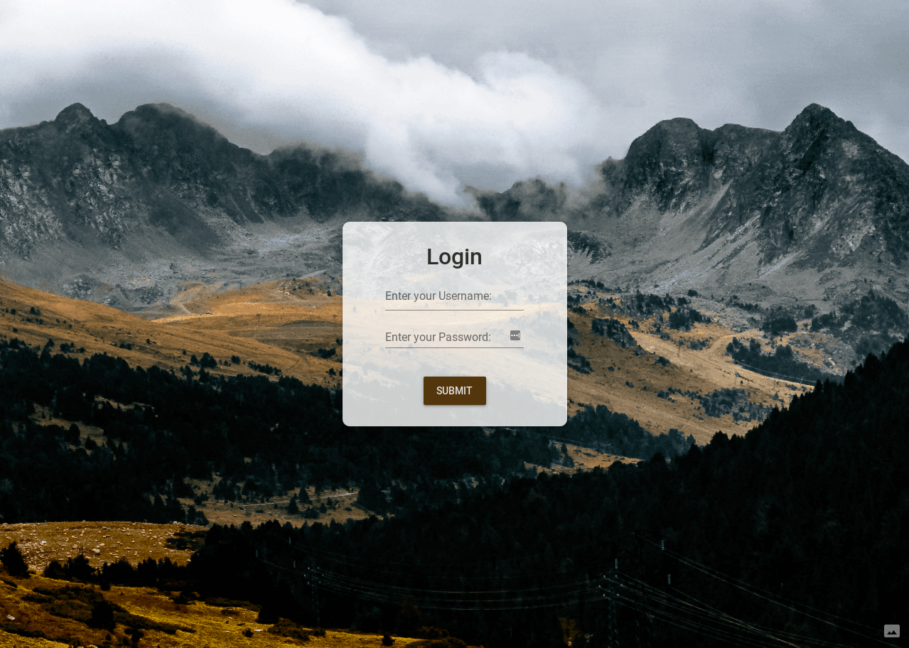
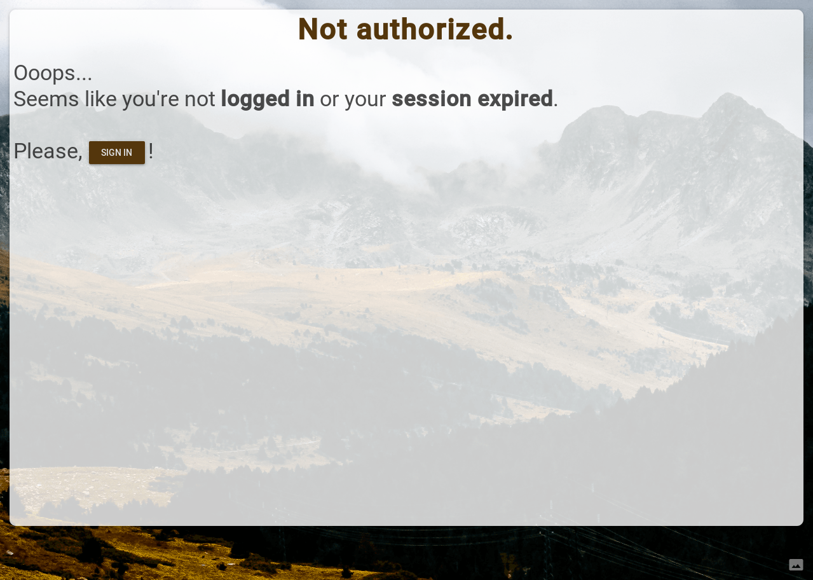
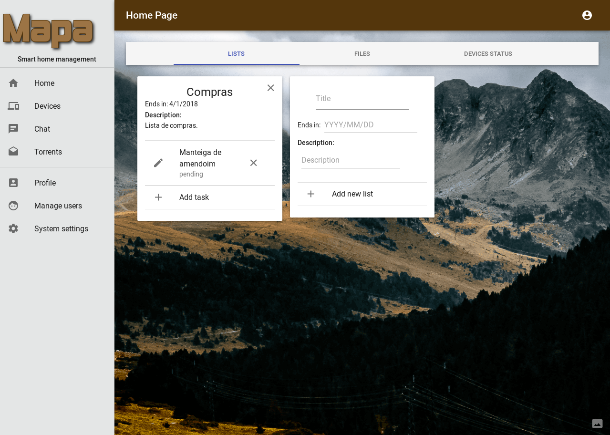

<a id="markdown-1-raspberry-pi-home-web-app" name="1-raspberry-pi-home-web-app"></a>
# 1. Raspberry Pi Home Web App

This Web App is a personal project meant to be the front-end implementation to a home website.
This document will go through every step of the development of the web app and will provide all the information needed to update and/or improve the web app as new features will be introduced by the back-end.
Please understand that English is not my main language so I'll do my best to keep my writing simple and concise and hopefully this project will be of any assistance to you.

<!-- TOC -->

- [1. Raspberry Pi Home Web App](#1-raspberry-pi-home-web-app)
  - [1.1. Getting started](#11-getting-started)
  - [1.2. Front-end](#12-front-end)
    - [1.2.1. Set up](#121-set-up)
    - [1.2.2. Folder structure](#122-folder-structure)
      - [1.2.2.1. Src folder](#1221-src-folder)
  - [1.3. Authentication flow](#13-authentication-flow)
  - [1.4. Login page](#14-login-page)
  - [1.5. Unauthorized page](#15-unauthorized-page)
  - [1.6. Home page](#16-home-page)
    - [1.6.1. Home Tabs](#161-home-tabs)
      - [1.6.1.1. Lists](#1611-lists)
      - [1.6.1.2. Files](#1612-files)
      - [1.6.1.3. Device Status](#1613-device-status)

<!-- /TOC -->

<a id="markdown-11-getting-started" name="11-getting-started"></a>
## 1.1. Getting started

To start the web app it's necessary that you have all the dependencies installed and for that run `yarn install`. Next all you need to do is to start server with `yarn start` to launch it.

In another file I will provide information about how to set up the back-end and front-end in a Raspberry Pi, using a HTTP server like Nginx.

<a id="markdown-12-front-end" name="12-front-end"></a>
## 1.2. Front-end

The fronted is written in React.js, using Material Design.
I chose React because it's a very popular framework in these days and I wanted to become more proficient with it and see what types of things I could build with it. I've used Vue2.js on other simple projects.

<a id="markdown-121-set-up" name="121-set-up"></a>
### 1.2.1. Set up

The web app must be capable of authentication and prevent that anyone can interact with it so, in order to implement an authentication flow throughout the application I realized I'd have to be able to save some sort of state. This state can be preserved by using Redux, and it's one of the dependencies for this web app.

Another thing that would be very helpful would be that ability to save bookmarks or navigate the web app by page with different routes, for that it's used React Router as a dependency.

I used a react template that comes with every dependency needed out of the box including webpack hot reloading and many other things necessary. The link is [https://github.com/notrab/create-react-app-redux.git](https://github.com/notrab/create-react-app-redux.git) if you want to check it out.

<a id="markdown-122-folder-structure" name="122-folder-structure"></a>
### 1.2.2. Folder structure

The folder is structured in 3 main folders:

- node_modules: That possess all the files relative to the dependency packages installed.
- public: That stores the index.html and all the static files needed.
- src: In this folder there's all the folders and files needed to develop the web app as well as the configuration files for Redux and React Router.

<a id="markdown-1221-src-folder" name="1221-src-folder"></a>
#### 1.2.2.1. Src folder

In this folder you can find 4 folders. Each of these folders group the files that belongs to the same purpose and keeps things organized.

For the `components` folder: All components are stored here. By components I mean any piece of front-end that can be re-utilized and used multiple times without breaking anything.

For the `containers` folder: This is the folder to store the different pages that the web app will have, each sub folder has an index.js file and an optional CSS file that corresponds to a certain page.

For the `images` folder: Here, the background image is stored and potentially other images can be stored here as well.

For the `modules` folder: All the Redux related files like, reducers/dispatchers are stored here.

In the src folder we can find the main index.js file that glues everything together as well as the store.js, configuration file that glues the Redux files together.

<a id="markdown-13-authentication-flow" name="13-authentication-flow"></a>
## 1.3. Authentication flow

To keep record if a user is logged we need our state to keep track of it. If we look into our modules folder inside src, we can find a auth.js file that has the following:

```javascript
const initialState = {
  username: "",
  logged_in: false,
  is_logging: false,
  token: "",
  user_id: -1
}
```

In the same file we can see the reducers and dispatchers associated with these state. The idea is that each time an user logs in all of its user information is stored in the state and can be accessed each time the user interacts with the web app to check if the current session is valid.

If the session is no longer valid the user needs to be redirected to a warning page.

In the upcoming sections I'll explain how this process is made and how we can use the Redux store to achieve it.

<a id="markdown-14-login-page" name="14-login-page"></a>
## 1.4. Login page

The first thing you see as a new user it's the login page. The registration of new players is done by the admin account.

```javascript
  constructor(props) {
    super(props);
    this.state = {
      username: '',
      password: '',
      open: false,
      message: "",
      vertical: "bottom",
      horizontal: "center"
    }
  }
```

This is the constructor of the Login React class, it needs the username and password to store the values written on the input boxes, and other variables are needed for the snack-bar to pop if anything goes wrong.

```javascript
  handleClick = () => {
    const body = {
      username: this.state.username,
      password: this.state.password,
      active: true,
    };

    fetch("http://localhost:3333/api/v1/login",
      {
        method: "POST",
        body: JSON.stringify(body),
        headers: {
          'Accept': 'application/json',
          'Content-Type': 'application/json'
        }
      })
      .then(r => r.json()).then(r => {
        if(r.type !== undefined) {
        localStorage.setItem('logged_in', true);
        localStorage.setItem('username', r.username);
        localStorage.setItem('token', r.token);
        localStorage.setItem('user_id', r.user_id);
        this.props.loginAccepted(r.username, r.token, r.user_id);
        this.props.changePage('home');
        }
        else {
          this.props.loginUnaccepted();
          localStorage.setItem('logged_in', false);
          localStorage.setItem('token', "");
          localStorage.removeItem('user_id');
          this.handleTouchTap(r[0].message);
        }
      })
      .catch( () => {
        this.props.loginUnaccepted();
        this.handleTouchTap("Error");
      });
  }
```

When the user presses the 'Submit' button it calls this function. As you can see it sends a HTTP request to the back-end and request for a login token that it's stored in the local storage as well as other useful information. This information is also stored in the Redux store and the user is redirected to the home page.

If anything goes wrong with the HTTP request the snack-bar is popped and the local storage is filled with relevant information about the succeeded.

The logged_in and token variables are needed so the web-app can know if the user really is authenticated. The local storage might preserve the info about the session but if the token expires the next interaction with web app will fail and redirect the user straight to the unauthorized page.

<p align="center">

</p>

<a id="markdown-15-unauthorized-page" name="15-unauthorized-page"></a>
## 1.5. Unauthorized page

Every user session that, for whatever reason, fails is redirected to this page. This page is a warning to alert the user that its session is expired or he's not logged in.
This page has a button that redirects the user to the login page.

<p align="center">

</p>

<a id="markdown-16-home-page" name="16-home-page"></a>
## 1.6. Home page

In the home page it's possible to identify two main components: the side bar and the main frame. 

The side bar contains shortcuts for the different pages that the web-app provides. In the top division it has all the feature pages and in the bottom division has all the management and settings pages available. 

The main frame is where the components for a certain page are rendered.

Every page that follows the login screen is fruit of three layers, the layout layer and the menu layer and the main frame layer.

The layout layer verifies if the user is authenticated, if not it displays the not authorized page.

```Javascript
  render() {
// Fetchs the localStorage for information, if there's nothing there relies on the Redux store values that were passed as props.
    let is_logged_in = localStorage.getItem('logged_in') || this.props.logged_in;
    let children = this.props.children;
    let style = this.props.style;

// If the user is logged in go ahead and render whatever components were passed as children. Otherswise show the notAuthorized page.
    return (
  <div>
    {is_logged_in ?
      (
        <div style={{ ...style }}>
          {children}
        </div>
      ) :
      (
        <LoginFailed />
      )}
  </div>
    );
  }
```

The menu layer has the side bar with the Mapa logo and the top bar that possess the page title and the logout option. As you can see this layer needs some props that are passed by the component that glues all the 3 layers that form a page, which is called 'page'.

The menu layer fetches the logo directly from the server as we can see down below. I chose to do it this way so I can change the logo image easily and just delete the one that's on the 'logo' folder and upload the new one.

As we can see it first sends a `GET` request in order to obtain the id of the logo image, as we need the id before we actually ask for the image it's used the `async` keyword in the `componentDidMount()` function so we can use the `await` on the first `fetch`. One advantage of fetching the logo image through the server is that it's the first thing that's done so, if any tokens are expired or the server is down or any other problem is detected the web-app can react to it.

```Javascript
  async componentDidMount() {
    const token = 'Bearer ' + localStorage.getItem('token');
    let logo_id = -1;
    await fetch("http://127.0.0.1:3333/api/v1/file/uploaded/logo",
      {
        method: "GET",
        headers: {
          'Accept': 'application/json',
          'Content-Type': 'application/json',
          'Authorization': token
        }
      })
      .then(r => r.json()).then(r => {
        if(r.error === undefined) {
          logo_id = r[0].id;
        }
      })
      .catch((err) => {
        this.props.logout();
        localStorage.setItem('logged_in', false);
        this.props.changePage('notAuthorized');
      });

    fetch("http://127.0.0.1:3333/api/v1/file/" + logo_id,
      {
        method: "GET",
        headers: {
          'Accept': 'application/json',
          'Content-Type': 'application/json',
          'Authorization': token
        }
      })
      .then(r => r.blob()).then(r => {
        if (r.error === undefined) {
          this.setState({ logo: URL.createObjectURL(r) });
        }
      })
      .catch((err) => {
        this.props.logout();
        localStorage.setItem('logged_in', false);
        this.props.changePage('notAuthorized');
      });

  }
```

The `page` component stacks the layers above explained and passes the required props to them like the logout function. These component also draws the little tooltip we can see on the bottom right corner linking to the owner of the background image.

```Javascript
  render() {
    const { title, children } = this.props;
    const username = localStorage.getItem('username');

    return (
      <Layout>
        <section>
          <MenuAppBar title={title} username={username} handleLogout={this.handleLogout}>
            {children}
          </MenuAppBar>
          <Tooltip id="tooltip-bottom-end" title="Background by Ricardo Sá" placement='bottom-end'>
            <IconButton aria-label="Background by Ricardo Sá" style={styles.icon} href="https://www.flickr.com/photos/148227787@N03/">
              <PhotoSizeSelectActual />
            </IconButton>
          </Tooltip>
        </section>
        </Layout>
    );
  }
```

<p align="center">

</p>

<a id="markdown-161-home-tabs" name="161-home-tabs"></a>
### 1.6.1. Home Tabs

There three tabs in the home page that the user can interact with.

<a id="markdown-1611-lists" name="1611-lists"></a>
#### 1.6.1.1. Lists

In the 'Lists' tab the user can create/delete/update new task lists and in each list it is possible for any user to add a task.

To create/delete/update each list and/or task there's a function responsible for that, that makes a request to the API.

In order to show the task lists on the page, every time the page loads the list of 'Lists' and 'Tasks' available is fetched and stored in the state.

<a id="markdown-1612-files" name="1612-files"></a>
#### 1.6.1.2. Files

In this tab the users can access their folders and files. They can also upload one or more files to the server.

Once again there's a function responsible for uploading the files to the server and every time the tab is clicked all the folders/files are fetched asynchronously to ensure the page runs smooth.

<a id="markdown-1613-device-status" name="1613-device-status"></a>
#### 1.6.1.3. Device Status

Here all the devices connected and present in the server's database will be shown informing the user if they're online.
